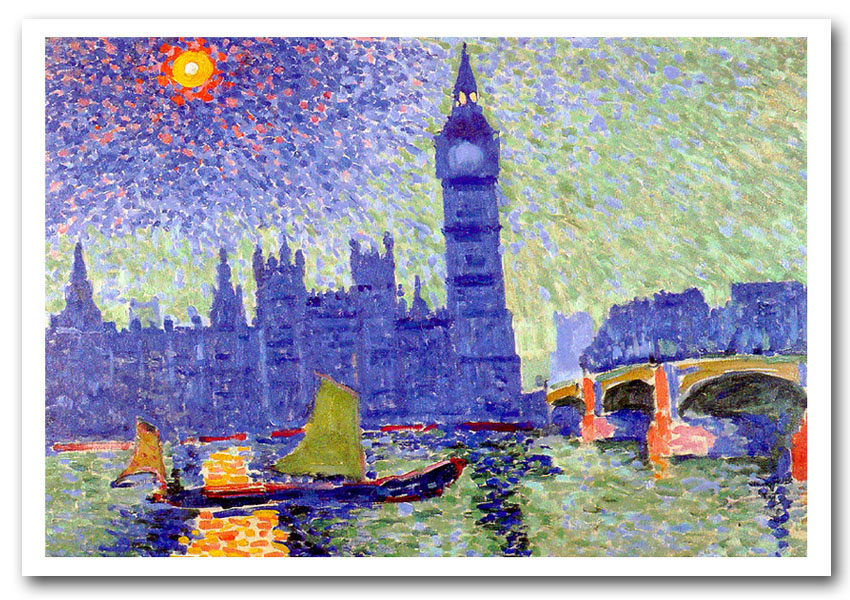

# We are stronger together.

>Monet painted dozens of images of the thames.

**H**ere’s a bracing lesson from Victorian history that might possibly help to slice some impossible Brexit knots. In the 19th century, there was complete freedom of movement of people from Europe to Britain. And that was all anyone needed. Europhiles might find it difficult to conceive of a time when the folk of continental Europe ached to get to Britain because it was only here that they could find stability, peace, and freedom from oppression. Remainers might find it impossible to imagine that this wholly independent nation — rather than being xenophobic — welcomed the newcomers, and revelled in the cultural riches that they brought.

Not just the brilliant music and exhilarating art and exciting restaurants and delicious wine, but even the light entertainment. Once seen, the music hall conjurer Professor Hermann — whose speciality was shooting white rabbits on stage and then resurrecting them — was never forgotten. Elsewhere, Richard Wagner, although displeased with skittish British audiences, loved visiting his south London friends in Camberwell.

You ask the shade of Joseph Conrad; or Monet, or Tissot, or Zola, or Van Gogh. There were no limits on duration of stay. No visa restrictions. No intrusive inquisitions from the authorities. And no over-arching European super-state comprising tens of thousands of ideologically driven bureaucrats requiring the UK to obey laws formulated by distant unaccountable officials.

Businessmen and merchants merrily travelled back and forth across the Channel aboard steamboats. In the 1870s, there was a service to Antwerp leaving yards from Tower Bridge. There is no reason why Britain now has to be trapped in some M.C. Escher maze of EU treaties to attract Europe’s finest and most energetic immigrants. At some stage, there are going to be many on the Continent who see Britain as a valuable refuge from stagnating uniformity.

It was in the course of researching my new book — a macabre and seemingly inexplicable murder in a middle-class boarding house in Victorian Bloomsbury — that I was drawn to this side of the city. The events of this case unfolded in 1879, and focused on a family called the Bastendorffs. Like Jean-Claude Juncker, the Bastendorffs were Luxembourgian. Unlike him, they grew up in an intensely rural world that knew nothing of tax arrangements for multi-nationals. Young Severin Bastendorff made the journey, via Paris, to London, arriving in 1869. He signed his name in a log book at Southampton dock; and that was it. Britain was his home. Nine years later, and by then married with four children, he decided to become naturalised as a British subject: a simpletown hall procedure and a certificate proclaiming his loyalty to Queen Victoria.

Bastendorff and his brothers specialised in upmarket furniture-making. Very soon, Severin was sufficiently successful to take the lease on a smart four-storey house in Euston Square. Bastendorff, and his German and French friends, revelled in the Bloomsbury pubs, some of which had started stocking continental lagers. Also nearby was the German Gymnasium at King’s Cross: as well as workouts with ropes and parallel bars, this offered grand evenings of classical music and banquets (indeed, it is still there today, now a grand restaurant).

Bastendorff was fond of good wine; he had his imported. Londoners generally were delighting in the new French cafés of Soho and Piccadilly. And there were German restaurants springing up north of Oxford Street.

All right, yes, the streets were also teeming with continental revolutionaries and radicals and proto-terrorists, who favoured pubs around Fitzrovia and Somers Town. German exile Johann Most was shouting about bullets and bombs in back-rooms in Charrington Street. And it hardly needs to be added that Karl Marx, roosting in the Reading Room of the British Museum, was another beneficiary of Britain’s relaxed ethos. Here was sanctuary.

Even Scotland Yard made efforts to ensure a smooth life for European arrivals. Inspector Charles Hagen of X Division was of German heritage; and throughout the 1870s, in cases involving continental criminals, he very often questioned them in their native tongues. One enterprising swindler from Germany had been caught by Hagen after attempting to sell non-existent super-weapons to the Russian ambassador.

The capital was suffused with continental lives and loves. Vincent Van Gogh had his young heart broken in a boarding house in Brixton; Claude Monet, having fled the Franco-Prussian War, gazed at the smoky Thames from the new embankment and bathed it in a rosy romanticism. In the Royal Albert Hall in 1879, Dr Siemens gave a hypnotic lecture on the future possibilities of electric light. In Dalston, a grand charity fundraiser for the German Hospital featured guests such as Count Bernstorff.

Meanwhile, a terrific German social and educational innovation — the kindergarten — was spreading fast. There were sometimes cracks in social cohesion: Italians, many of whom favoured Clerkenwell, were broadly popular (as indeed was the novelty of their food) but there were many Italian street music performers who drove residents of quieter streets mad.

The social harmony was also stretched in the poorer streets of the East End; and indeed, in the end, it snapped. In part, it was the immense influx of eastern European Jewish refugees, fleeing murderous persecution, that eventually led to the 1905 Aliens Act restricting ‘undesirables’ (an anti-Semitic euphemism): this was when, in a new 20th-century age of creeping imperial paranoia, the first controls on immigration were set down.

But the Victorians had been brilliantly open. Funnily enough, in 1879, a group of Westphalian businessmen were contemplating the long-standing German customs union, and wondered if it might be extended to Britain. Victorian London proved something greater: that an independent country need not be fearful or insular but instead always eager to welcome fresh talented souls.

Credit to [Sinclair McKay](https://www.spectator.co.uk/2018/08/freedom-of-movement-isnt-an-eu-invention-victorian-london-thrived-on-it/) for superior words to the ones I could hope to express.

Follow me on [github](www.github.com/alexandercannon) & [twitter](www.twitter.com/alexmcan) for more.
